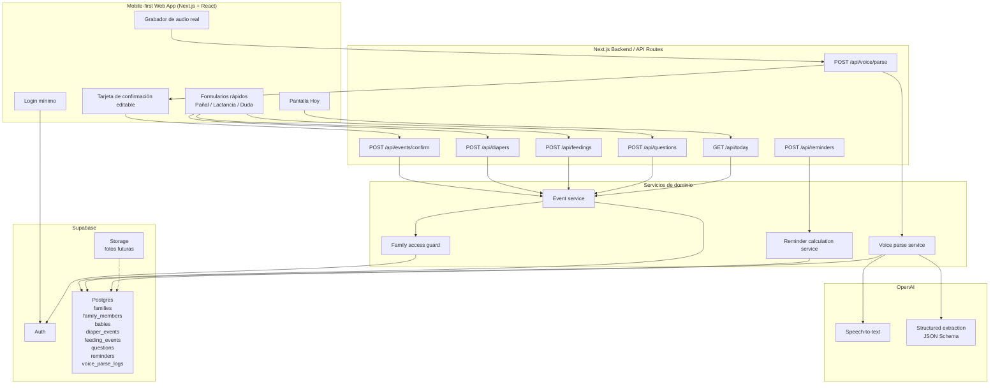

# PRD — Herramienta de registro y asistencia para padres/madres primerizos

## 1. Resumen ejecutivo

Este producto es una herramienta diseñada para padres y madres primerizos de bebés recién nacidos que necesitan registrar información frecuente durante el día, muchas veces cada pocas horas o incluso hora a hora.

El objetivo inicial es construir una **web app mobile-first compartida** que permita registrar de forma rápida eventos clave del bebé: pañales, lactancia, dudas médicas y recordatorios de próximas tomas. La herramienta debe estar optimizada para situaciones reales de uso: poco sueño, una mano ocupada, bebé en brazos, necesidad de rapidez y bajo margen de error.

La funcionalidad diferencial del producto será la **carga por voz**, permitiendo que el usuario grabe o suba un audio del estilo:

> “Arrancó lactancia a las tres y diez, tomó izquierda doce minutos y derecha ocho, poné alarma en dos horas y media.”

La app deberá transcribir ese audio, clasificarlo, interpretarlo y proponer un registro estructurado para que el usuario confirme antes de guardarlo.

El MVP será una web app con persistencia real en Supabase y audio real procesado con IA. No será todavía una app pública ni una experiencia completa de onboarding familiar. La V1 será una app nativa reutilizando la mayor cantidad posible de lógica, backend y modelo de datos.

---

## 2. Problema

Los padres/madres primerizos necesitan llevar un registro frecuente de información del bebé, especialmente durante los primeros días/semanas:

* Cantidad y tipo de pañales.
* Horarios de lactancia.
* Duración aproximada de tomas.
* De qué pecho tomó.
* Próxima toma o alarma.
* Dudas para pediatra, neonatólogo o puericultora.
* Comentarios o fotos ante eventos llamativos.

Actualmente, estos registros suelen hacerse de forma fragmentada: notas del celular, WhatsApp entre padres, alarmas manuales, memoria, fotos sueltas o apps genéricas.

El problema se agrava porque el usuario está cansado, con poco sueño y muchas veces físicamente ocupado con el bebé. La experiencia debe minimizar carga cognitiva y pasos manuales.

---

## 3. Objetivos del producto

### 3.1 Objetivos principales

1. Permitir registrar pañales diarios de forma rápida.
2. Permitir registrar lactancia y próximas alarmas.
3. Permitir registrar dudas para próximas consultas médicas.
4. Permitir carga por voz mediante audio transcripto e interpretado.
5. Mostrar un resumen simple del día.
6. Permitir uso compartido inicial entre madre y padre.
7. Diseñar una arquitectura reutilizable para futura app nativa.

### 3.1.1 Objetivos post-MVP

1. Permitir registrar sueño liviano como parte del estado diario del bebé.
2. Preparar un resumen simple para consultas médicas.
3. Incorporar notificaciones reales cuando la plataforma lo permita con confiabilidad suficiente.

### 3.2 Objetivos de experiencia

La app debe poder usarse:

* Con una mano.
* Con sueño.
* En menos de 10 segundos para acciones frecuentes.
* Sin necesidad de completar formularios largos.
* Con defaults inteligentes.
* Con confirmación antes de guardar datos interpretados por IA.

### 3.3 Objetivos técnicos

* MVP web app mobile-first.
* Backend centralizado.
* Base de datos persistente.
* Acceso compartido inicial para una familia y un bebé.
* Transcripción con modelo GPT mini / speech-to-text de OpenAI.
* Clasificación de audios en eventos estructurados.
* Preparación para PWA y, luego, app nativa.
* Lógica de parsing y datos reutilizable por web y app nativa.

---

## 4. Usuarios objetivo

### Usuario principal

Padre o madre primerizo/a de un bebé recién nacido.

Características:

* Alto nivel de cansancio.
* Necesita registrar eventos muchas veces al día.
* Usa principalmente celular.
* Necesita compartir información con pareja o cuidadores.
* Puede necesitar mostrar información a pediatra, neonatólogo o puericultora.

### Usuarios secundarios

* Pareja/copadre/copadre.
* Abuelos o cuidadores.
* Puericultora, pediatra o neonatólogo como receptores indirectos de la información.

---

## 5. Principios de producto

1. **Rapidez antes que completitud.** Registrar rápido es más importante que capturar todos los detalles.
2. **Confirmar antes de guardar lo interpretado por IA.** La IA no debe crear registros definitivos sin revisión del usuario.
3. **Defaults inteligentes.** Hora actual, bebé activo, tipo frecuente, alarma sugerida.
4. **Menos campos obligatorios.** Comentarios, fotos y duraciones deben ser opcionales.
5. **Mobile-first real.** Botones grandes, pocos pasos, diseño para pulgar.
6. **No interpretar médicamente.** La app registra y organiza, pero no diagnostica.
7. **Privacidad por defecto.** No guardar audios originales salvo decisión explícita.
8. **Reutilización técnica.** Backend, schemas y lógica de interpretación deben servir para web y app nativa.

---

# 6. MVP — Web App

## 6.1 Alcance del MVP

El MVP será una **alfa funcional compartida** para uso real de una familia específica, no una versión pública. Debe resolver el caso central: madre y padre registran eventos del mismo bebé desde sus celulares y ven el mismo estado actualizado.

### Decisiones cerradas para MVP

* Un único bebé inicial.
* Persistencia en Supabase desde el inicio.
* Acceso compartido para madre y padre desde el MVP.
* Audio real desde la web app, procesado con IA.
* Confirmación obligatoria antes de guardar eventos interpretados por IA.
* Pantalla principal única "Hoy" con acciones rápidas y timeline.
* Recordatorio calculado y visible en la app desde el MVP.
* Notificaciones push/web como iteración posterior, salvo que el setup sea simple y no bloquee el MVP.

### Funcionalidades incluidas en MVP

El MVP será una web app mobile-first con las siguientes secciones o módulos:

1. Hoy.
2. Pañales.
3. Lactancia.
4. Dudas.
5. Registro por voz.

Debe permitir:

* Usar un bebé inicial.
* Registrar pañal.
* Registrar lactancia.
* Calcular y mostrar próxima toma/recordatorio.
* Registrar dudas.
* Grabar audio real desde la web app.
* Transcribir audio.
* Clasificar audio.
* Convertir audio en evento estructurado.
* Confirmar o editar antes de guardar.
* Ver resumen del día.
* Persistir eventos en Supabase.
* Permitir que madre y padre vean los mismos datos.

### Fuera del MVP

* Onboarding público.
* Soporte multi-bebé.
* Flujo completo de invitación a cuidadores.
* Roles avanzados de familia.
* Sueño.
* Fotos de pañales.
* Export para consulta médica.
* Modo consulta médica.
* App nativa.
* Offline-first.
* Notificaciones nativas confiables.
* Widgets o Shortcuts.
* Diagnóstico o recomendación médica.

---

## 6.2 Pantalla “Hoy”

La pantalla principal debe mostrar el estado actual del día.

### Contenido sugerido

* Botón principal: “🎙 Registrar por voz”.
* Botones rápidos:

  * “+ Pañal”
  * “+ Lactancia”
  * “+ Duda”
* Última toma.
* Próxima toma sugerida o alarma activa.
* Último pañal.
* Cantidad de pañales de hoy.
* Cantidad de tomas de hoy.
* Dudas pendientes.
* Timeline breve del día.

### Ejemplo

```text
Hoy

[ 🎙 Registrar por voz ]

[ + Pañal ] [ + Lactancia ] [ + Duda ]

Última toma: 03:10
Próxima alarma: 05:40
Último pañal: 04:05 — pis + caca
Pañales hoy: 5
Tomas hoy: 4
Dudas pendientes: 3
```

---

## 6.3 Registro de pañales

### Campos

Cada evento de pañal debe guardar:

* ID.
* Baby ID.
* Fecha/hora de creación.
* Fecha/hora del evento.
* Tipo de pañal:

  * Solo pis.
  * Solo caca.
  * Pis + caca.
  * Seco, opcional.
* Comentario opcional.
* Flag “algo raro” / “marcar para revisar”.
* Usuario que registró.

### UX deseada

Flujo rápido:

```text
Abrir app → + Pañal → elegir tipo → guardar
```

Campos obligatorios:

* Tipo de pañal.
* Hora, con default “ahora”.

Campos opcionales:

* Comentario.
* Marcar como raro.

### Reglas

* La hora debe cargarse automáticamente como “ahora”.
* El usuario puede editar la hora.
* El comentario no debe ser obligatorio.
* La foto queda para una iteración posterior y no forma parte del MVP.

---

## 6.4 Registro de lactancia

### Campos

Cada evento de lactancia debe guardar:

* ID.
* Baby ID.
* Fecha/hora de creación.
* Hora de inicio.
* Hora de fin opcional.
* Pecho izquierdo usado: sí/no.
* Duración izquierda opcional.
* Pecho derecho usado: sí/no.
* Duración derecha opcional.
* Comentario opcional.
* Recordatorio elegido:

  * 2 horas.
  * 2 horas y media.
  * 3 horas.
  * Sin recordatorio.
* Hora calculada del recordatorio.
* Usuario que registró.

### UX deseada

Flujo rápido:

```text
+ Lactancia → “Empezó ahora” → elegir pecho opcional → elegir alarma → guardar
```

O desde voz:

```text
“Arrancó lactancia a las tres y diez, izquierda doce minutos, derecha ocho, alarma en dos horas y media.”
```

### Regla clave

La próxima alarma debe calcularse **desde el inicio de la lactancia**, no desde el final.

Ejemplo:

* Inicio: 03:10.
* Alarma elegida: 2h30.
* Próxima alarma: 05:40.

### Timer opcional

Para MVP puede ser opcional o postergado. El MVP puede permitir ingresar duración manualmente. Una evolución podría agregar:

* Iniciar timer izquierdo.
* Cambiar a derecho.
* Finalizar toma.

---

## 6.4.1 Registro de sueño liviano — iteración posterior

### Objetivo

Agregar registro básico de sueño porque aparece como funcionalidad de base en los principales baby trackers. Esta funcionalidad queda fuera del MVP inicial para proteger el foco en Supabase compartido, lactancia, pañales, dudas y audio real con IA.

El objetivo futuro no es predecir ventanas de sueño ni hacer coaching, sino resolver una necesidad simple:

```text
¿Hace cuánto está despierto o durmiendo?
```

### Campos

Cada evento de sueño debe guardar:

* ID.
* Baby ID.
* Fecha/hora de creación.
* Hora de inicio.
* Hora de fin opcional.
* Tipo:

  * Siesta.
  * Noche.
  * Sin especificar.
* Comentario opcional.
* Usuario que registró.

### UX deseada

Flujo rápido:

```text
+ Sueño → “Se durmió ahora” → guardar
```

Si hay un sueño activo:

```text
+ Sueño → “Se despertó ahora” → guardar fin
```

Flujo por voz:

```text
“Se durmió recién.”
“Se despertó a las cinco y cuarto.”
“Durmió de una y veinte a dos y cinco.”
```

### Reglas

* La hora debe cargarse automáticamente como “ahora”.
* El usuario puede editar inicio y fin.
* Debe existir como máximo un sueño activo por bebé.
* Si el usuario intenta iniciar otro sueño con uno activo, la app debe pedir resolver el anterior.
* No calcular recomendaciones de sueño.
* No incluir wake windows automáticos, SweetSpot ni coaching de sueño.

---

## 6.5 Recordatorios / alarmas en MVP web

### Objetivo

Permitir que la app recuerde la próxima toma sin que el usuario configure manualmente una alarma cada vez.

### MVP

En el MVP, el recordatorio debe existir como **dato calculado, persistido y visible**. Es decir: al registrar lactancia, la app calcula `reminderAt`, lo guarda y lo muestra claramente en "Hoy".

Las notificaciones push/web quedan como iteración posterior, salvo que puedan implementarse sin bloquear el flujo principal de audio real + Supabase.

### Comportamiento esperado

Después de registrar lactancia, la app pregunta:

```text
¿Querés recordatorio para la próxima toma?

[ 2h ] [ 2h30 ] [ 3h ] [ No ]
```

Si el usuario elige una opción:

* Se calcula `reminderAt`.
* Se guarda en DB.
* Se muestra en pantalla principal.
* Se muestra como próximo recordatorio activo.

### Iteración posterior: notificaciones

Limitaciones conocidas:

* En iPhone, las notificaciones web tienen restricciones.
* La confiabilidad puede depender de que la web app esté instalada como PWA.
* No se garantiza el mismo comportamiento que una alarma nativa del Clock de iPhone.

Cuando se avance con push/PWA:

* Se pide permiso de notificación.
* Se intenta registrar una notificación web/PWA.
* Se muestra estado de permisos.
* Si no se pueden activar notificaciones, se mantiene fallback visual dentro de la app.
* Se muestra claramente la próxima hora sugerida.
* Eventualmente se permite copiar/crear recordatorio manual.

---

## 6.6 Sección de dudas

### Objetivo

Permitir registrar dudas para próximas visitas con pediatra, neonatólogo, puericultora u otros profesionales.

### Campos

Cada duda debe guardar:

* ID.
* Baby ID.
* Fecha de creación.
* Texto.
* Categoría:

  * Lactancia.
  * Pañales.
  * Sueño.
  * Peso.
  * Piel.
  * Cordón umbilical.
  * Medicación.
  * Otro.
* Profesional:

  * Pediatra.
  * Neonatólogo.
  * Puericultora.
  * Otro.
* Estado:

  * Pendiente.
  * Respondida.
* Prioridad:

  * Normal.
  * Próxima consulta.
  * Urgente/revisar antes.
* Respuesta o nota posterior opcional.
* Usuario que registró.

### UX deseada

Flujo manual:

```text
+ Duda → escribir/dictar texto → elegir profesional opcional → guardar
```

Flujo por voz:

```text
“Duda para la pediatra: ¿es normal que tenga hipo después de tomar?”
```

Resultado propuesto:

```json
{
  "intent": "create_question",
  "professional": "pediatrician",
  "category": "feeding",
  "text": "¿Es normal que tenga hipo después de tomar?",
  "priority": "normal"
}
```

---

# 7. Registro por voz

## 7.1 Objetivo

Permitir que el usuario registre eventos sin navegar formularios, usando audio.

Esta funcionalidad debe ser tratada como un canal de carga principal, no como un agregado secundario.

## 7.2 Tipos de entrada

El MVP debe soportar:

1. Grabar audio desde la web app.
2. Subir un archivo de audio, si técnicamente es simple.
3. Transcribir el audio.
4. Clasificarlo.
5. Proponer un evento estructurado.
6. Pedir confirmación antes de guardar.

## 7.3 Modelo elegido

Usar solución integrada con OpenAI/GPT mini para:

* Transcripción de audio.
* Clasificación/interpretación del texto.
* Extracción estructurada del evento.

Modelo sugerido para transcripción:

* `gpt-4o-mini-transcribe` o equivalente vigente al momento de implementación.

Modelo sugerido para clasificación/extracción:

* Modelo GPT mini económico con Structured Outputs / JSON Schema.

No usar modelo grande salvo necesidad puntual.

## 7.4 Flujo técnico

```text
Usuario graba audio
→ Frontend genera archivo de audio
→ POST /api/voice/parse
→ Backend envía audio a transcripción
→ Backend recibe texto
→ Backend envía texto a clasificador con schema
→ Backend devuelve evento propuesto
→ Frontend muestra tarjeta de confirmación
→ Usuario confirma/edita/descarta
→ POST /api/events/confirm
→ Backend guarda evento
```

## 7.5 Separación importante

El endpoint de voz no debe guardar automáticamente el evento final.

Debe haber dos pasos:

1. Parsear/proponer.
2. Confirmar/guardar.

Esto evita registros incorrectos por audios mal interpretados.

## 7.6 Intenciones soportadas en MVP

```ts
type VoiceIntent =
  | "register_diaper"
  | "register_feeding"
  | "create_question"
  | "set_reminder"
  | "unknown";
```

La intención `register_sleep` queda para la iteración en la que se incorpore sueño liviano.

## 7.7 Ejemplos de comandos

### Pañales

```text
“Pañal pis ahora.”
“Cambió pañal recién, pis y caca.”
“Pañal a las seis, solo caca, color medio verdoso.”
```

### Lactancia

```text
“Arrancó lactancia ahora.”
“Arrancó lactancia a las tres y diez.”
“Tomó izquierda doce minutos y derecha ocho.”
“Empezó a tomar a las cuatro y media, poné alarma en tres horas.”
```

### Sueño — iteración posterior

```text
“Se durmió recién.”
“Se despertó a las cinco y cuarto.”
“Durmió de una y veinte a dos y cinco.”
```

### Dudas

```text
“Duda para la pediatra: ¿es normal que haga hipo después de tomar?”
“Anotame para la puericultora si está prendiendo bien cuando hace chasquido.”
```

### Recordatorios

```text
“Poneme alarma en dos horas.”
“Recordame la próxima toma en dos horas y media.”
```

## 7.8 Output esperado del parser de voz

El backend debe devolver un objeto normalizado.

### Ejemplo: lactancia

```json
{
  "intent": "register_feeding",
  "confidence": 0.94,
  "transcript": "Arrancó lactancia a las tres y diez, izquierda doce minutos, derecha ocho, alarma en dos horas y media.",
  "proposedEvent": {
    "type": "feeding",
    "startedAt": "2026-06-24T03:10:00-03:00",
    "endedAt": null,
    "leftBreastUsed": true,
    "rightBreastUsed": true,
    "leftBreastMinutes": 12,
    "rightBreastMinutes": 8,
    "notes": null,
    "reminderOption": "2h30",
    "reminderAt": "2026-06-24T05:40:00-03:00"
  },
  "needsConfirmation": true,
  "warnings": []
}
```

### Ejemplo: pañal

```json
{
  "intent": "register_diaper",
  "confidence": 0.91,
  "transcript": "Cambió pañal recién, pis y caca, color medio raro.",
  "proposedEvent": {
    "type": "diaper",
    "eventTime": "2026-06-24T04:05:00-03:00",
    "diaperType": "pee_poop",
    "comment": "color medio raro",
    "abnormalFlag": true
  },
  "needsConfirmation": true,
  "warnings": []
}
```

### Ejemplo futuro: sueño

```json
{
  "intent": "register_sleep",
  "confidence": 0.9,
  "transcript": "Durmió de una y veinte a dos y cinco.",
  "proposedEvent": {
    "type": "sleep",
    "startedAt": "2026-06-24T01:20:00-03:00",
    "endedAt": "2026-06-24T02:05:00-03:00",
    "sleepType": "unknown",
    "notes": null
  },
  "needsConfirmation": true,
  "warnings": []
}
```

### Ejemplo: duda

```json
{
  "intent": "create_question",
  "confidence": 0.88,
  "transcript": "Duda para la pediatra: ¿es normal que tenga hipo después de tomar?",
  "proposedEvent": {
    "type": "question",
    "text": "¿Es normal que tenga hipo después de tomar?",
    "category": "feeding",
    "professional": "pediatrician",
    "priority": "normal",
    "status": "pending"
  },
  "needsConfirmation": true,
  "warnings": []
}
```

## 7.9 Manejo de ambigüedad

La app debe detectar y advertir ambigüedades.

Ejemplos:

* “A las tres” puede ser 03:00 o 15:00.
* “Hace un rato” puede ser demasiado ambiguo.
* “Tomó bastante” no implica duración exacta.
* “Durmió” sin inicio/fin puede requerir completar un dato.
* “Poneme alarma” sin duración.
* Audio sin intención clara.

### Reglas sugeridas

* “Ahora” = timestamp actual.
* “Recién” = timestamp actual, salvo que se defina otra regla.
* “Hace X minutos” = now - X minutos.
* “A las tres”:

  * Elegir la ocurrencia más plausible dentro de las últimas 12 horas.
  * Si hay duda fuerte, mostrar warning.
* Si falta un dato crítico, pedir edición/confirmación.
* No inventar duraciones.
* No inventar tipo de pañal si no se menciona.
* No inventar profesional de la duda si no se menciona; usar “otro” o dejar null según schema.

## 7.10 Tarjeta de confirmación

Después de cada audio, mostrar una tarjeta editable.

Ejemplo:

```text
Detecté una lactancia

Inicio: 03:10
Izquierda: 12 min
Derecha: 8 min
Alarma: 05:40

[ Confirmar ] [ Editar ] [ Descartar ]
```

Para pañal:

```text
Detecté un pañal

Hora: 04:05
Tipo: pis + caca
Comentario: color medio raro
Marcado para revisar: sí

[ Confirmar ] [ Editar ] [ Descartar ]
```

Para sueño, en una iteración posterior:

```text
Detecté sueño

Inicio: 01:20
Fin: 02:05
Tipo: sin especificar

[ Confirmar ] [ Editar ] [ Descartar ]
```

Para duda:

```text
Detecté una duda

Para: Pediatra
Categoría: Lactancia
Texto: ¿Es normal que tenga hipo después de tomar?

[ Confirmar ] [ Editar ] [ Descartar ]
```

## 7.11 Privacidad de audios

Por defecto:

* No guardar audio original.
* Usar audio solo para procesar.
* Guardar transcripción solo si el usuario confirma el evento o si sirve como metadata del evento confirmado.
* Permitir borrar eventos.
* No usar la app para diagnóstico médico automático.

Opcional futuro:

* Toggle “guardar audio original”.
* Configuración de retención.
* Export de datos.

---

# 8. Arquitectura técnica MVP

## 8.1 Stack sugerido

### Frontend

* Next.js.
* React.
* TypeScript.
* Tailwind o sistema de estilos simple.
* Mobile-first.
* PWA-ready.

### Backend

* Next.js API routes / route handlers.
* Supabase para DB y Auth.
* OpenAI API para transcripción e interpretación, siempre llamada desde backend.
* Timezone: `America/Argentina/Buenos_Aires` como default inicial, configurable a futuro.

### Base de datos

* Supabase Postgres.

### Storage

* Supabase Storage para fotos de pañales en una iteración posterior.
* No guardar audios por defecto.

### Deploy

* Vercel para web.
* Supabase para backend/data.

## 8.1.1 Modelo de acceso compartido

El MVP necesita ser compartido por madre y padre desde el inicio. Hay tres opciones:

### Opción A — Cuenta compartida

Madre y padre usan el mismo usuario/login.

Ventajas:

* Más rápido de implementar.
* Menos fricción inicial.

Desventajas:

* No permite saber quién registró cada evento.
* Complica permisos futuros.
* Genera deuda para separar usuarios después.

### Opción B — Usuarios individuales, familia creada manualmente

Cada adulto tiene su usuario de Supabase Auth, pero no existe todavía un flujo público de invitación. La familia, el bebé y la relación `family_members` pueden crearse manualmente o con un seed inicial.

Ventajas:

* Permite compartir datos desde el inicio.
* Permite auditar quién registró cada evento.
* Evita migrar de cuenta compartida a multiusuario.
* No requiere construir onboarding/invitaciones todavía.

Desventajas:

* Requiere implementar Auth mínima.
* Requiere una configuración inicial manual.

### Opción C — Invitaciones completas

Cada familia puede invitar cuidadores desde la app.

Ventajas:

* Es la solución de producto más completa.

Desventajas:

* Es demasiado alcance para el MVP.

### Recomendación MVP

Usar **Opción B**: usuarios individuales con Supabase Auth, una familia inicial y un bebé inicial configurados manualmente. El flujo de invitación queda para iteración posterior.

## 8.2 Servicios principales

```text
Frontend Web
  ├── Home / Today
  ├── Diaper form
  ├── Feeding form
  ├── Questions
  ├── Voice recorder
  ├── Voice confirmation card
  └── Minimal auth screen

Backend API
  ├── /api/voice/parse
  ├── /api/events/confirm
  ├── /api/diapers
  ├── /api/feedings
  ├── /api/questions
  ├── /api/reminders
  └── /api/today

Supabase
  ├── Auth
  ├── Postgres
  └── Storage (future photos, not MVP)

OpenAI
  ├── Audio transcription
  └── Structured extraction
```

## 8.2.1 Diagrama de estructura técnica MVP



## 8.2.2 Iteraciones técnicas previstas

```text
Iteración 1 — MVP compartido con audio real
  ├── Supabase Auth mínima
  ├── Familia/bebé inicial
  ├── Eventos manuales
  └── Voice recorder
      ├── Transcripción
      ├── Extracción estructurada
      └── Confirmación antes de guardar

Iteración 2 — Recordatorios reales
  ├── Permisos de notificaciones
  ├── Web push/PWA si es viable
  ├── Fallback visual
  └── Cancelar/snooze

Iteración 3 — Sharing robusto
  ├── Invitación a cuidadores
  ├── Roles
  └── Gestión de miembros

Iteración 4 — Sueño liviano
  ├── Registro iniciar/cerrar sueño
  ├── Timeline
  └── Soporte por voz

Iteración 5 — Evidencia y consulta
  ├── Fotos de pañales
  ├── Export/resumen médico
  └── Mejoras en dudas

Iteración 6 — App nativa
  ├── Notificaciones locales confiables
  ├── Offline básico
  └── Widgets/shortcuts
```

## 8.3 Endpoints sugeridos

### `POST /api/voice/parse`

Input:

* Audio file.
* Baby ID.
* User ID.
* Client timestamp.
* Timezone.

Output:

* Transcript.
* Intent.
* Confidence.
* Proposed event.
* Warnings.

No debe guardar evento final.

### `POST /api/events/confirm`

Input:

* Proposed event edited/confirmed.
* Source: manual | voice.
* Transcript opcional.
* User ID.
* Baby ID.

Output:

* Saved event.

### `POST /api/diapers`

Crear pañal manual.

### `POST /api/feedings`

Crear lactancia manual.

### `POST /api/questions`

Crear duda manual.

### `GET /api/today`

Resumen del día.

Output:

* Última toma.
* Próxima alarma.
* Último pañal.
* Conteo de pañales.
* Conteo de tomas.
* Dudas pendientes.
* Timeline.

---

# 9. Modelo de datos

## 9.1 Baby

```ts
type Baby = {
  id: string;
  name: string;
  birthDate: string;
  createdAt: string;
  familyId: string;
};
```

## 9.2 User / Family

```ts
type Family = {
  id: string;
  createdAt: string;
  name?: string;
};

type FamilyMember = {
  id: string;
  familyId: string;
  userId: string;
  role: "parent" | "caregiver" | "viewer";
  createdAt: string;
};
```

## 9.3 DiaperEvent

```ts
type DiaperEvent = {
  id: string;
  babyId: string;
  familyId: string;
  createdByUserId: string;
  createdAt: string;
  eventTime: string;
  diaperType: "pee" | "poop" | "pee_poop" | "dry";
  comment?: string;
  photoUrl?: string;
  abnormalFlag: boolean;
  source: "manual" | "voice";
  transcript?: string;
};
```

## 9.4 FeedingEvent

```ts
type FeedingEvent = {
  id: string;
  babyId: string;
  familyId: string;
  createdByUserId: string;
  createdAt: string;
  startedAt: string;
  endedAt?: string;
  leftBreastUsed?: boolean;
  rightBreastUsed?: boolean;
  leftBreastMinutes?: number;
  rightBreastMinutes?: number;
  notes?: string;
  reminderOption?: "2h" | "2h30" | "3h" | "none";
  reminderAt?: string;
  source: "manual" | "voice";
  transcript?: string;
};
```

## 9.5 SleepEvent — iteración posterior

El modelo queda documentado para una iteración posterior, pero no forma parte del primer MVP implementable.

```ts
type SleepEvent = {
  id: string;
  babyId: string;
  familyId: string;
  createdByUserId: string;
  createdAt: string;
  startedAt: string;
  endedAt?: string;
  sleepType: "nap" | "night" | "unknown";
  notes?: string;
  source: "manual" | "voice";
  transcript?: string;
};
```

## 9.6 Question

```ts
type Question = {
  id: string;
  babyId: string;
  familyId: string;
  createdByUserId: string;
  createdAt: string;
  text: string;
  category:
    | "feeding"
    | "diaper"
    | "sleep"
    | "weight"
    | "skin"
    | "umbilical_cord"
    | "medication"
    | "other";
  professional:
    | "pediatrician"
    | "neonatologist"
    | "lactation_consultant"
    | "other";
  status: "pending" | "answered";
  priority: "normal" | "next_visit" | "urgent";
  answer?: string;
  source: "manual" | "voice";
  transcript?: string;
};
```

## 9.7 Reminder

```ts
type Reminder = {
  id: string;
  babyId: string;
  familyId: string;
  createdByUserId: string;
  createdAt: string;
  relatedEventType: "feeding" | "sleep" | "other";
  relatedEventId?: string;
  remindAt: string;
  status: "scheduled" | "sent" | "cancelled" | "failed";
  channel: "web_push" | "native_local" | "none";
};
```

## 9.8 VoiceParseLog

Guardar solo metadata mínima, sin audio.

```ts
type VoiceParseLog = {
  id: string;
  babyId: string;
  familyId: string;
  userId: string;
  createdAt: string;
  transcript: string;
  detectedIntent: string;
  confidence?: number;
  accepted: boolean;
  discarded: boolean;
  corrected: boolean;
  error?: string;
};
```

---

# 10. Seguridad, privacidad y compliance

## 10.1 Principios

* La app registra información, no diagnostica.
* No debe dar recomendaciones médicas automatizadas.
* No debe decir “esto es normal” o “esto es grave” salvo que exista una feature médica validada en el futuro.
* El resumen para consulta médica debe presentar datos y dudas, no interpretar síntomas.
* Debe facilitar que el usuario consulte a un profesional.

## 10.2 Datos sensibles

La app puede contener información sensible sobre salud y hábitos de un bebé. Por eso:

* Usar autenticación.
* Separar datos por `familyId`.
* Aplicar Row Level Security si se usa Supabase.
* No guardar audios por defecto.
* Permitir borrar eventos.
* No entrenar modelos con datos del usuario, salvo configuración explícita y compatible con proveedores.
* Mostrar disclaimer claro: la app no reemplaza consejo médico.

## 10.3 Disclaimer sugerido

```text
Esta app ayuda a registrar información del bebé y organizar dudas. No reemplaza la consulta con profesionales de salud. Ante síntomas preocupantes o urgencias, contactá a tu pediatra, neonatólogo o servicio médico.
```

---

# 11. Métricas de éxito

## 11.1 Métricas de producto

* Registros por día.
* % de registros hechos por voz.
* Tiempo promedio para crear registro manual.
* Tiempo promedio para confirmar registro por voz.
* Tasa de edición de registros interpretados por voz.
* Tasa de descarte de registros por voz.
* Cantidad de dudas creadas.
* Cantidad de dudas marcadas como respondidas.
* Uso compartido: cantidad de familias con más de un usuario.

### Métricas post-MVP

* Cantidad de registros de sueño por día.
* Uso de resumen de consulta médica.

## 11.2 Métricas de calidad de IA

* Accuracy de clasificación de intención.
* Accuracy de extracción de hora.
* Accuracy de tipo de pañal.
* Accuracy de duración de lactancia.
* Accuracy de profesional/categoría en dudas.
* Porcentaje de casos con warnings.
* Porcentaje de casos en `unknown`.
* Costo promedio por audio.
* Latencia promedio de parseo de audio.

### Métricas de IA post-MVP

* Accuracy de inicio/fin de sueño.

## 11.3 Métricas técnicas

* Latencia de `POST /api/voice/parse`.
* Errores de transcripción.
* Errores de OpenAI API.
* Fallas de permisos de micrófono.

### Métricas técnicas post-MVP

* Errores de subida de fotos.
* Entrega de notificaciones.
* Fallas de permisos de notificaciones.

---

# 12. Backlog por iteraciones

## 12.1 MVP inicial — alfa compartida con audio real

## Epic 1 — Setup

1. Crear proyecto Next.js + TypeScript.
2. Configurar Supabase.
3. Configurar Auth.
4. Configurar estructura de DB.
5. Configurar variables de entorno para OpenAI.

## Epic 2 — Modelo familiar

1. Crear familia inicial.
2. Crear bebé inicial.
3. Asociar usuarios madre/padre a la familia.
4. Resolver `familyId` y `babyId` activos desde la sesión.
5. Dejar flujo de invitación para una iteración posterior.

## Epic 3 — Pañales

1. Crear formulario rápido de pañal.
2. Guardar evento en DB.
3. Mostrar pañales del día.
4. Permitir comentario opcional.
5. Permitir marcar como raro.
6. Dejar foto opcional para una iteración posterior.

## Epic 4 — Lactancia

1. Crear formulario rápido de lactancia.
2. Guardar inicio de lactancia.
3. Permitir pecho izquierdo/derecho.
4. Permitir duración opcional por pecho.
5. Permitir elegir recordatorio.
6. Calcular `reminderAt` desde `startedAt`.
7. Mostrar última toma y próxima alarma.

## Epic 5 — Dudas

1. Crear duda.
2. Listar dudas pendientes.
3. Marcar como respondida.
4. Agregar profesional opcional.
5. Dejar filtros y respuesta/nota posterior para una iteración posterior.

## Epic 6 — Hoy

1. Crear endpoint/resolver de resumen diario.
2. Mostrar última toma.
3. Mostrar próxima alarma.
4. Mostrar último pañal.
5. Mostrar conteos del día.
6. Mostrar dudas pendientes.
7. Mostrar timeline simple.

## Epic 7 — Voz

1. Crear componente grabador de audio.
2. Permitir subir audio al backend.
3. Crear endpoint `POST /api/voice/parse`.
4. Integrar transcripción OpenAI.
5. Integrar extracción estructurada con GPT mini.
6. Definir JSON Schema de eventos.
7. Mostrar tarjeta de confirmación.
8. Permitir editar evento propuesto.
9. Confirmar y guardar.
10. Descartar evento.
11. Loguear resultado de parseo sin guardar audio.

## Epic 8 — Recordatorios visuales

1. Guardar reminders en DB.
2. Mostrar próxima alarma en pantalla “Hoy”.
3. Mostrar estado claro si existe recordatorio activo.
4. Permitir cancelar o reemplazar el próximo recordatorio.
5. Dejar push/web notifications para una iteración posterior.

## Epic 9 — Privacidad y configuración

1. No guardar audios por defecto.
2. Agregar disclaimer.
3. Permitir borrar eventos.
4. Agregar configuración básica de zona horaria.
5. Agregar configuración de retención futura, si aplica.

## 12.2 Iteraciones posteriores

## Iteración 2 — Notificaciones reales

1. Pedir permisos de notificación.
2. Programar recordatorio web/PWA cuando sea posible.
3. Mostrar estado de permisos.
4. Mantener fallback visual dentro de la app.
5. Evaluar límites de iOS/PWA antes de prometer comportamiento tipo alarma nativa.

## Iteración 3 — Sueño liviano

1. Crear acción rápida “+ Sueño”.
2. Permitir iniciar sueño con default “ahora”.
3. Permitir cerrar sueño activo con default “ahora”.
4. Permitir editar inicio y fin.
5. Mostrar sueño activo o último sueño en “Hoy”.
6. Mostrar total de sueño registrado del día.
7. Incluir sueño en timeline.
8. Soportar intención `register_sleep` en voz.
9. Evitar más de un sueño activo por bebé.
10. Mantener fuera predicciones, wake windows automáticos y coaching.

## Iteración 4 — Resumen para consulta médica

1. Crear vista simple “Resumen para consulta”.
2. Permitir elegir período: hoy, últimas 24h, últimos 7 días.
3. Mostrar conteos de tomas, pañales y sueño.
4. Mostrar dudas pendientes y dudas marcadas para próxima consulta.
5. Mostrar eventos con flag “algo raro” / “marcar para revisar”.
6. Permitir copiar resumen en texto plano.
7. Permitir compartir/exportar resumen simple, sin necesidad de PDF.
8. Incluir disclaimer médico en la vista.

---

# 13. V1 — App nativa

## 13.1 Objetivo

Construir una app nativa para iOS, y eventualmente Android, reutilizando backend, modelo de datos, lógica de parsing y schemas del MVP web.

La app nativa debe mejorar principalmente:

* Confiabilidad de notificaciones.
* Grabación de audio.
* Experiencia offline.
* Velocidad de uso.
* Posible integración con widgets/shortcuts.
* Mejor experiencia mobile real.

## 13.2 Stack sugerido

* React Native / Expo.
* Supabase como backend compartido.
* OpenAI API vía backend.
* Notificaciones locales nativas.
* Storage compartido.
* Posible uso futuro de Apple Speech Framework para transcripción nativa/local.

## 13.3 Funcionalidades V1

Además de todo el MVP:

1. Notificaciones locales nativas confiables.
2. Mejor grabación de audio.
3. Soporte offline básico.
4. Sincronización cuando vuelve conexión.
5. Widgets de iOS:

   * Última toma.
   * Próxima toma.
   * Botón rápido para registrar.
6. Shortcuts/Siri, si aplica:

   * “Registrar pañal”.
   * “Registrar lactancia”.
   * “Anotar duda”.
7. Mejor soporte de fotos.
8. Push notifications si hay varios cuidadores.
9. Export para consulta médica.

## 13.4 Reutilización desde MVP

Deben reutilizarse:

* Base de datos.
* Auth.
* Storage.
* Endpoints.
* JSON Schemas.
* Lógica de cálculo de recordatorios.
* Lógica de parsing de voz.
* Modelo de permisos familiares.
* Tipos TypeScript, idealmente en paquete compartido.

## 13.5 Offline-first

La app nativa debería permitir:

* Crear eventos sin conexión.
* Guardarlos en cola local.
* Sincronizarlos cuando vuelva internet.
* Marcar conflictos, si los hubiera.
* Evitar duplicados.

## 13.6 Notificaciones nativas

La V1 debe reemplazar o complementar web push con notificaciones locales nativas.

Comportamiento:

* Al confirmar lactancia con recordatorio, programar notificación local.
* Si se edita/elimina evento, actualizar/cancelar notificación.
* Si hay varios dispositivos, definir si todos reciben recordatorio o solo quien lo creó.

---

# 14. Decisiones cerradas y pendientes antes de codear

Esta sección separa lo que ya quedó decidido para el MVP de lo que todavía puede bloquear el desarrollo.

## 14.0 Decisiones cerradas para MVP

1. El producto empieza como uso personal/familiar controlado, no como distribución pública.
2. El MVP tiene un único bebé inicial.
3. El MVP usa Supabase desde el inicio.
4. El MVP requiere acceso compartido entre madre y padre.
5. El MVP incluye audio real procesado con IA.
6. Todo evento interpretado por IA requiere confirmación antes de guardarse.
7. Los recordatorios del MVP se calculan, persisten y muestran en la app; push queda para iteración posterior.
8. Sueño liviano queda fuera del MVP inicial.
9. Resumen para consulta médica queda fuera del MVP inicial.
10. No se guardan audios originales por defecto.

## 14.1 Producto — pendientes críticas

1. Nombre del producto.
2. Confirmar modelo de acceso para el primer build:
   * recomendado: usuarios individuales con Supabase Auth y familia creada manualmente;
   * alternativa rápida: cuenta compartida.
3. ¿Qué nivel de edición histórica se permite?
4. ¿Se pueden borrar eventos o solo archivarlos?
5. ¿Se incluye pañal seco desde MVP?

## 14.2 Lactancia

1. ¿El recordatorio default será 2h, 2h30 o ninguno?
2. ¿La alarma se calcula siempre desde inicio de toma?
3. ¿Se permite registrar mamadera/fórmula desde MVP?
4. ¿Se permite registrar extracción de leche?
5. ¿Se requiere timer real o solo ingreso manual?
6. ¿Qué pasa si una toma queda sin finalizar?
7. ¿Hay que registrar ambos pechos como booleano o solo duración cuando aplique?

## 14.3 Voz

1. Duración máxima del audio: ¿20s, 30s o 60s?
2. ¿Se permite subir audios además de grabarlos?
3. ¿Se guarda transcripción siempre o solo si se confirma?
4. ¿Se guarda log de audios descartados?
5. ¿Qué confidence mínima requiere confirmación especial?
6. ¿Qué casos deben devolver `unknown`?
7. ¿Se permitirá guardar automáticamente comandos de alta confianza o siempre confirmar?
8. ¿Qué modelo exacto de OpenAI se usará para transcripción?
9. ¿Qué modelo exacto se usará para clasificación?
10. ¿Habrá fallback si falla OpenAI?
11. ¿Idioma inicial solo español rioplatense o multilenguaje?
12. ¿Cómo manejar ruido de fondo/bebé llorando?

## 14.4 Alarmas y notificaciones

Estas preguntas aplican a la iteración posterior de notificaciones reales:

1. ¿Se requiere PWA instalada para la prueba?
2. ¿Qué hacer si el usuario no da permisos de notificación?
3. ¿Quién recibe la alarma: quien registró, todos los cuidadores o configurable?
4. ¿Se debe permitir snooze?
5. ¿Se debe permitir cancelar próxima alarma?
6. ¿Se debe integrar con calendario/reloj o no?

## 14.5 Sueño liviano

Estas preguntas aplican a la iteración posterior de sueño:

1. ¿El registro debe ser solo iniciar/finalizar o también permitir cargar rango histórico?
2. ¿Queremos distinguir siesta/noche o dejarlo opcional?
3. ¿Se muestra total de sueño del día o solo último sueño/sueño activo?
4. ¿Qué copy evita transformar la app en una herramienta ansiógena de sleep tracking?

## 14.6 Privacidad

1. ¿Se requiere política de privacidad desde MVP aunque sea de uso familiar/controlado?
2. ¿Cómo se eliminan datos de una familia?
3. ¿Se permite export completo en una iteración posterior?
4. ¿Se necesita PIN/FaceID en app nativa?

## 14.7 UI/UX

1. ¿Estilo visual deseado?
2. ¿Tono de la app: cálido, clínico, minimalista?
3. ¿Colores?
4. ¿Iconografía?
5. ¿Diseño para modo oscuro?
6. ¿Botón de voz fijo abajo?
7. ¿Bottom nav o pantalla única?
8. ¿Qué tan grande debe ser el touch target mínimo?
9. ¿Se prioriza una experiencia tipo app o tipo dashboard?

---

# 15. Benchmark

Relevamiento actualizado el 2026-06-24.

## 15.1 Apps más relevantes

### Competidores más cercanos

| App | Por qué importa | Qué hace bien | Gap aprovechable para este producto |
| --- | --- | --- | --- |
| [Huckleberry](https://apps.apple.com/us/app/huckleberry-baby-child/id1169136078) | Baby tracker fuerte con foco en sueño. App Store: 4.9, 67K ratings, categoría Medical. | Tracking de lactancia, pañales, sueño, pumping, crecimiento, medicación, múltiples cuidadores, recordatorios, reportes e IA. Tiene AI Logging por texto, voz o foto en planes pagos. | La voz ya no es un diferencial absoluto. El gap está en una experiencia mucho más simple, en español, enfocada en primeros 30/60 días y sin empujar coaching de sueño. |
| [Nara Baby](https://apps.apple.com/us/app/nara-baby-pregnancy-tracker/id1444639029) | El comparable más cercano en simplicidad y calma visual. App Store: 4.9, 22K ratings. | Tracking de feeds, pañales, naps, wake windows, pumping, growth, milestones, medicación, cuidadores, múltiples bebés, widgets y Siri. También incluye bienestar de la madre. | Muy buen benchmark de UX. Gap: no parece centrarse en carga conversacional/voz natural ni en “dudas para consulta” como flujo principal. |
| [Baby Tracker - Newborn Log](https://apps.apple.com/us/app/baby-tracker-newborn-log/id779656557) | Tracker clásico y masivo. App Store: 4.8, 227K ratings, disponible en español. | Registro rápido con una mano de alimentación, pañales y sueño; notas/fotos; sync entre cuidadores; PDF/email export; backups. | Es completo pero más utilitario. Gap: una capa de IA/voz y un flujo de consulta médica más humano podrían diferenciar. |

### Competidores adyacentes

| App | Por qué importa | Qué hace bien | Gap aprovechable para este producto |
| --- | --- | --- | --- |
| [Glow Baby](https://apps.apple.com/us/app/glow-baby-tracker-growth-app/id1077177456) | Suite amplia de salud/maternidad. App Store: 4.7, 23K ratings. | Tracking integral de alimentación, pañales, sueño, pumping, crecimiento, recursos, comunidad e insights pagos. | Riesgo de complejidad, comunidad y privacidad percibida. Nuestro producto debería evitar parecer red social o app médica opinadora. |
| [Cubtale](https://www.cubtale.com/cubtale-baby-app) | All-in-one app con foco en rutinas, patrones, recuerdos y guidance. Declara 200K padres y rating 4.9. | Trackea breastfeeding, pump, inventario de leche, bottles, milestones, growth, solids, sleep, medicine, symptoms, diapers, widgets y reminders. | Buen recordatorio de features futuras, pero demasiado amplio para MVP. Útil para decidir qué no copiar todavía. |

## 15.2 Lectura del benchmark

1. La tríada básica del mercado es **alimentación + pañales + sueño**. Sueño es relevante para la categoría, pero queda como iteración posterior porque el primer diferencial a validar es audio real + registro compartido.
2. El registro para responder preguntas médicas aparece una y otra vez como caso de uso: “cuántos pañales”, “cuándo comió”, “cuánto durmió”. El PRD mantiene dudas médicas en MVP y deja resumen médico para una iteración posterior.
3. La carga por voz sigue siendo una apuesta válida, pero Huckleberry ya ofrece AI Logging por texto, voz o foto en planes pagos. El diferencial no puede depender solo de “voz”; tiene que ser **voz simple, rioplatense, rápida y con confirmación segura**.
4. Multiusuario/cuidadores ya es expectativa de categoría, no diferencial.
5. Export/share de datos es más importante de lo que parecía. No hace falta PDF sofisticado al inicio, pero sí conviene sumar un resumen copiable/compartible después del MVP.
6. Las apps líderes tienden a expandirse a sueño avanzado, milestones, growth, medicación, comunidad y contenido. Copiar eso en MVP sería un error: aumenta complejidad y puede volver la app ansiógena.
7. Hay un espacio claro para un producto más chico: primeros 30/60 días, registro ultra rápido, voz como canal principal, dudas para profesionales y privacidad explícita.

## 15.3 Funcionalidades derivadas para backlog

### Agregar a iteraciones posteriores

1. **Sueño liviano**: iniciar/finalizar sueño, mostrar sueño activo o último sueño, incluirlo en timeline y soportarlo por voz.
2. **Resumen para consulta médica**: vista simple por período con tomas, pañales, sueño, dudas pendientes y eventos marcados para revisar; export inicial como texto copiable/compartible.

### Mantener fuera del MVP

1. Sleep coaching.
2. Predicción de wake windows.
3. Gráficos complejos.
4. Comunidad.
5. Growth charts.
6. Milestones.
7. Medicación/vacunas, salvo que una necesidad real lo vuelva urgente.
8. Inventario de leche/pumping avanzado.

## 15.4 Hipótesis de diferenciación actualizadas

1. La carga por voz puede ser un diferencial si reduce pasos reales, no si es solo un input alternativo.
2. La sección de dudas y el resumen para consulta pueden ser más valiosos que dashboards complejos.
3. La UX ultra simple puede ganarle a apps más completas para el caso “primeros días con poco sueño”.
4. El foco en primeros 30/60 días puede evitar competir contra suites gigantes de crianza.
5. Privacidad, no guardar audios y confirmación antes de guardar son parte de la propuesta, no solo requisitos técnicos.

---

# 16. UI / Diseño para completar después

Esta sección queda como placeholder para diseño visual y UX detallada.

## 16.1 Principios UI preliminares

* Mobile-first.
* Uso con una mano.
* Botones grandes.
* Alto contraste.
* Pocos campos.
* Nada de formularios largos para acciones frecuentes.
* Confirmaciones claras.
* Lenguaje humano, no técnico.
* No saturar con gráficos.
* Mostrar estado actual antes que histórico complejo.

## 16.2 Navegación preliminar

Opción recomendada MVP:

```text
Pantalla única “Hoy”
  ├── Registrar por voz
  ├── Acciones rápidas
  ├── Resumen del día
  └── Timeline
```

Botón flotante/global:

```text
🎙 Voz
```

Alternativa post-MVP:

```text
Bottom nav:
- Hoy
- Pañales
- Lactancia
- Dudas
```

## 16.3 Componentes a diseñar

1. Botón principal de voz.
2. Grabador de audio.
3. Estado “transcribiendo”.
4. Estado “interpretando”.
5. Tarjeta de confirmación.
6. Formulario rápido de pañal.
7. Formulario rápido de lactancia.
8. Selector de alarma.
9. Lista de dudas.
10. Timeline del día.
11. Card de próxima toma.
12. Card de último pañal.
13. Empty states.
14. Error states.
15. Permisos de micrófono.

### Componentes post-MVP

* Acción rápida de sueño.
* Resumen para consulta médica.
* Card de sueño activo o último sueño.
* Permisos de notificación.

## 16.4 Copy preliminar

### Voz

```text
Registrar por voz
Decime qué pasó y lo cargo por vos.
```

### Confirmación

```text
Detecté esto. Revisalo antes de guardar.
```

### Error de voz

```text
No pude entender bien el audio. Podés intentar de nuevo o cargarlo manualmente.
```

### Notificaciones — post-MVP

```text
¿Querés que te avise para la próxima toma?
```

### Sueño — post-MVP

```text
Registrar sueño
Solo guardamos cuándo se durmió y cuándo despertó.
```

### Resumen para consulta — post-MVP

```text
Resumen para consulta
Tomas, pañales, sueño y dudas en un solo lugar.
```

### Disclaimer médico

```text
Esta app ayuda a registrar información. No reemplaza la consulta con profesionales de salud.
```

---

# 17. Riesgos

## 17.1 Riesgos de producto

* La app puede volverse demasiado compleja.
* Los usuarios pueden abandonar si registrar toma más de pocos segundos.
* La carga por voz puede fallar con ruido o frases ambiguas.
* Las notificaciones web pueden no ser suficientemente confiables.
* El registro de sueño puede volver la app ansiógena si se presenta como performance o score.
* Los usuarios pueden esperar recomendaciones médicas que el producto no debe dar.

## 17.2 Riesgos técnicos

* Compatibilidad de grabación de audio en iOS web.
* Permisos de micrófono.
* Latencia de transcripción.
* Costos si se abusa de audios largos.
* Parseo incorrecto de horarios.
* Notificaciones PWA limitadas.
* Manejo de timezone y madrugada.
* Sincronización multiusuario.

## 17.3 Mitigaciones

* Confirmación obligatoria antes de guardar eventos por voz.
* Límite de duración de audio.
* No usar realtime en MVP.
* No guardar audios por defecto.
* Usar Structured Outputs.
* Mostrar warnings ante ambigüedad.
* Mantener carga manual como fallback.
* Mantener sueño en modo registro liviano, sin predicción ni score.
* Medir tasa de edición/descarte de registros por voz.
* Diseñar primero para uso personal/controlado.

---

# 18. Criterios de aceptación MVP

El MVP se considera funcional cuando:

1. Madre y padre pueden acceder a la misma familia y al mismo bebé inicial.
2. Un usuario autenticado puede registrar un pañal manualmente en menos de 10 segundos.
3. Puede registrar lactancia manualmente.
4. Puede elegir recordatorio de 2h, 2h30 o 3h desde inicio de lactancia.
5. El recordatorio se guarda y se muestra como próxima toma en “Hoy”.
6. Puede crear dudas manualmente.
7. Puede grabar un audio real desde la web app.
8. El audio se transcribe.
9. El audio se clasifica como pañal, lactancia, duda, recordatorio o unknown.
10. La app muestra una tarjeta de confirmación editable.
11. El usuario puede confirmar y guardar el evento.
12. El usuario puede descartar el evento.
13. La pantalla “Hoy” muestra resumen actualizado desde Supabase.
14. No se guardan audios originales por defecto.
15. Hay disclaimer médico visible.
16. La app es usable desde celular.

---

# 19. No objetivos del MVP

El MVP no incluye:

* Diagnóstico médico.
* Recomendaciones clínicas.
* Chat médico.
* Sueño.
* Resumen para consulta médica.
* Fotos de pañales.
* Notificaciones push/web garantizadas.
* Sleep coaching.
* Wake windows automáticos.
* Predicción de siestas.
* Peso.
* Medicación.
* Gráficos complejos.
* Marketplace.
* Comunidad.
* App nativa.
* Widgets.
* Siri/Shortcuts.
* Realtime voice assistant.
* Integración profunda con Clock de iPhone.
* Soporte offline completo.
* Multi-idioma avanzado.

---

# 20. Próximo paso recomendado

Antes de codear:

1. Confirmar modelo de acceso: usuarios individuales con familia creada manualmente vs cuenta compartida.
2. Cerrar decisiones mínimas de lactancia, pañales y voz.
3. Definir schema Supabase inicial.
4. Definir JSON Schema de extracción por voz.
5. Diseñar wireframe simple de “Hoy”.
6. Crear proyecto Next.js + Supabase Auth.
7. Implementar eventos manuales contra Supabase.
8. Integrar grabación de audio real.
9. Integrar transcripción y parser estructurado.
10. Testear con audios reales de 5 a 20 segundos.
11. Ajustar UX de confirmación.

La prioridad debe ser construir una versión pequeña, estable y usable en contexto real, antes de expandir el alcance.
